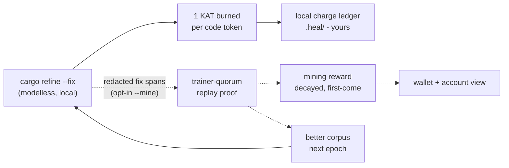

# cargo-refine

**A modelless code healer for Rust — point it at your crate, keep the mechanical fixes.**
No trained weights, no AI service, no network calls at heal time. Your code never leaves your machine.

## TL;DR

macOS / Linux:

```sh
curl -fsSL https://raw.githubusercontent.com/gist-rs/cargo-refine/main/install.sh | sh
```

Windows (PowerShell):

```powershell
iwr -useb https://raw.githubusercontent.com/gist-rs/cargo-refine/main/install.ps1 | iex
```

Homebrew (prebuilt formula — nothing is compiled):

```sh
brew tap gist-rs/tap && brew trust gist-rs/tap && brew install cargo-refine
```

Scoop:

```powershell
scoop bucket add gist-rs https://github.com/gist-rs/scoop-bucket
scoop install cargo-refine
```

Installers place `cargo-refine` in `~/.cargo/bin` (Windows: `%USERPROFILE%\.cargo\bin`),
so the `cargo refine` subcommand works in any Rust project. They resolve the latest
release from the GitHub API (pin one with `CARGO_REFINE_VERSION=v0.1.3` on install.sh,
`-Version v0.1.3` on install.ps1), auto-pick the Windows `msvc`/`gnu` asset —
preferring `msvc` when a release ships both — and verify every download against
the release's `SHA256SUMS` before extracting anything.

> **Caveat — v0.1.2 / v0.1.3 binaries:** the released binaries default
> `RIIR_HEAL_KAT_SERVICE_URL` to `heal.gist.rs`, which has no public DNS record
> yet. Until v0.1.4 ships a built-in fallback host chain, point them at the live
> front explicitly:
>
> ```sh
> export RIIR_HEAL_KAT_SERVICE_URL=https://ai.gist.rs
> ```
>
> ```powershell
> [Environment]::SetEnvironmentVariable("RIIR_HEAL_KAT_SERVICE_URL","https://ai.gist.rs","User")  # Windows: persists for new shells
> ```

Then, inside a Rust crate:

```sh
cargo refine --suggest src/   # ranked suggestions — writes nothing
cargo refine --fix src/       # bounded, span-preserving fixes (review before writing)
cargo refine --fix --write .  # apply + automatic rustfmt when the file was rustfmt-clean
```

## What it heals

Every rule is a **bounded fix**: a narrowly-scoped, mechanical transform with a
compile-checked or syntax-checked safety gate. The healer is deliberately
conservative — it declines anything it cannot prove safe, and never invents
beyond its compiled fix space. Counts below are measured by
`cargo refine --corpus-stats` at release time (2026-09-07, v0.1.x binaries).

| Domain | In the binary | Rules | What it fixes | Status |
|---|---|---|---|---|
| `clippy_lints` | yes, default | **49** | `cargo clippy` warnings across style / complexity / perf classes (38 with bounded auto-fixes) | GOAT-gated |
| `rust_perf` | yes, default | **112** | Rust performance patterns (allocation, cloning, loop shape, collection choice) | benchmark-Pareto promoted |
| `docker` | yes, default | **31** | Dockerfile issues (hadolint-shaped findings, bounded fixes; no registry calls) | GOAT-gated |
| `rustc_errors` | yes, default | E0597 family | `cargo refine --fix-compile` — compile-error repair keyed by error code, bounded by `--max-iters` | GOAT-gated (N=212) |
| latent retrieval | yes, default | — | span-level rule ranking over the enabled domains (`--suggest` / `--fix`), self-evolve trajectory store kept locally | default-on |
| KAT account | yes, default (v0.1.1+) | — | `cargo refine login` / `account` — the identity + burn/balance view for the heal network (below) | devnet |
| `kernel_opt` | not in this binary | 559 | GPU kernel optimization rules | ships in a future release |
| `sec` | not in this binary | 12 | security-pattern bounded fixes | ships in a future release |

**What it is NOT:**

- **Not an LLM.** No trained weights, no AI service, no prompt calls. The fixes
  come from a compiled, human-authored rule corpus.
- **Not a network citizen at heal time.** Healing is local and offline. The only
  network features (corpus lease refresh, KAT sync) are separate, opt-in, and
  shipped separately (see status below).
- **Not a formatter or a linter.** It composes with `cargo clippy` and
  `rustfmt` — it fixes what they report, mechanically.

## The KAT heal network

`cargo-refine` is also the client for **KAT**, the network's unit of account:

- **Healing burns KAT** — 1 KAT per million code-word tokens (the local meter
  counts micro-KAT). Your meter and charge ledger live under `.heal/` in your
  project; nothing is billed or submitted without you.
- **Every account starts with a free grant** — 100,000,000 KAT, once per
  account key. Claiming it is local until the ledger syncs (below).
- **Miners earn KAT** by contributing redacted fix spans that prove new value
  through deterministic replay. Rewards decay per epoch — first discovery pays
  most.
- **Parameters are bounded.** Supply caps, the free grant, and prices are on a
  published never-lever list; a guard-railed governor can tune decay inside
  hard ledger-enforced bounds and nothing else. There is no unbacked mint.
- **Devnet honestly:** KAT is a devnet token today. There is no USD price, no
  withdrawal, and no promise of one — treat it as points in a service economy
  while the network hardens.



*Solid edges run today (the local meter + burn ledger ship in the binary).
Dashed edges are the mining loop — opt in once with `cargo refine --mine`;
only redacted, signed batches ever leave the machine.*

### Join (60 seconds)

```sh
cargo refine login     # one-time: creates your Ed25519 account key (or adopts your SSH key)
cargo refine account   # your account id, grant projection, per-repo burn, balance
```

The key is a plain OpenSSH Ed25519 file under `~/.config/riir-heal/`. You can
import an existing key instead: `cargo refine login --key <path>`. Nothing
leaves your machine at this step.

**The earning half is live:** `cargo refine --mine` — run once to join: opts
in, logs you in, syncs. After that, every heal run auto-syncs your redacted
batch; `cargo refine sync` pushes manually. Miners are paid from 70% of every
KAT the network burns, at each epoch settle.

### Service status

| Surface | URL | Status |
|---|---|---|
| Consumer front (the network's home) | `https://ai.gist.rs` | live |
| Web wallet | `https://ai.gist.rs/wallet` | live (sign-in opens when the OAuth app is configured) |
| Contribution leaderboard (pseudonymous, epoch-scoped) | `https://ai.gist.rs/leaderboard` | live |
| Service plane (machine API; the CLI default) | `https://heal.gist.rs` | not publicly resolvable yet — set `RIIR_HEAL_KAT_SERVICE_URL=https://ai.gist.rs` (see caveat above) |

Earlier `v0.1.0`/`v0.1.1` binaries default to the retired `kat.heal.gist.rs` URL —
export `RIIR_HEAL_KAT_SERVICE_URL=https://heal.gist.rs` for those; **v0.1.2
defaults to `heal.gist.rs`** and ships `login` / `update` / `sync` in the
release binary.

### The just-works surface (v0.1.2)

```sh
cargo refine          # DRY RUN: review what would be fixed, zero edits
cargo refine --fix    # REAL fix: writes in place (compile-gated on fix builds)
cargo refine --mine   # what KAT mining is + the policy + how to earn
cargo refine login    # claim your 100M KAT devnet grant
cargo refine sync     # push redacted batches (the mining contribution)
cargo refine account  # burn, balance, grant, network state
```

## Node tiers — what you can run

One binary, four ways to run it. Roles (what you do) × tiers (the machine +
account posture). Capabilities only: a tier earns only what settles on the
network today — this table never promises a future reward class.

| role ↓ · tier → | Lite · any desktop, free | Pro · any desktop + login | Max · CPU box, no GPU | Ultra · GPU rig / VPS |
|---|---|---|---|---|
| **Coder** — heal your own code | ✅ anonymous dry-run + fix | ✅ optional login; the free grant covers burns | — | — |
| **Miner** — contribute batches, earn KAT | — anonymous earns nothing | ✅ **the earn tier today** | — | — |
| **Fixer** — verify & fix the network's queue | — | — | operator lane runs today (our nodes) · third-party replay designed, **does not settle yet** | — |
| **Trainer** — host the daily training window | — | — | — | **our replicas only at launch** |

- **Lite** — the bare binary you just installed: modelless, offline,
  anonymous, free forever. Outside the economy by design: no KAT, no
  earnings, never on the leaderboard.
- **Pro** — the same binary with an account: `cargo refine login` once, then
  `cargo refine --mine`. Every synced batch that proves novel becomes a claim
  on the epoch pool — every row on the
  [leaderboard](https://ai.gist.rs/leaderboard) is a Pro miner.
- **Max** — a CPU box (~2–4 vCPU, 4–8 GB) contributor lane. The API drain
  over the unproven queue runs today as the operator's own nodes, and its
  accepted work settles through the miner rows. Third-party replay
  verification (re-run the fixes on your own rig, agree with a second
  verifier) is designed, but its reward class does not settle yet —
  nothing is promised until it does.
- **Ultra** — the trainer node: stake, host the daily training window. At
  launch it runs on our replicas only; third-party installs open when the
  stake/vessel machinery matures.

Burn at Pro: 1 KAT per million code-word tokens; the one-time free grant is
100,000,000 KAT per account. Start at Lite (install above) —
`cargo refine login && cargo refine --mine` turns the same install into Pro.
Live tier details: <https://ai.gist.rs>.

## Privacy & data posture

- **Healing is offline.** No code, spans, paths, or telemetry leave the machine
  during `--suggest` / `--fix`.
- **The meter and charge ledger are local files** (`.heal/` in your project,
  the account key in `~/.config/riir-heal/`). Delete them and they are gone.
- **The only planned egress is opt-in mining sync**, and it sends *redacted*,
  content-addressed fix spans under a data-use license — never raw files.
  Kill switch for the local meter: `RIIR_HEAL_KAT_METER=0`.

## Verify a download

Every release carries a `SHA256SUMS` file, and the installers verify
automatically. To verify by hand:

```sh
shasum -a 256 -c SHA256SUMS     # macOS
sha256sum -c SHA256SUMS         # Linux / Windows (Git Bash)
```

Binaries are not code-signed yet (SmartScreen/Gatekeeper may ask on first run).
Release notes live on the [releases page](https://github.com/gist-rs/cargo-refine/releases).

## FAQ

**Why did it skip a warning my `cargo clippy` shows?**
The healer only carries a bounded fix for a rule when the transform is
mechanical and gated. Rules without a safe fix-space are deliberately absent —
a wrong "fix" is worse than no fix.

**Does `--fix` ever break my code?**
Fixes are span-preserving and bounded by construction, and `--fix` without
`--write` shows every edit first. With `--write`, files that were already
`rustfmt`-clean are re-formatted automatically; pre-existing formatting drift
is left alone so the diff stays mechanical.

**Why is `--verify` slow?**
It re-runs the compiler (`cargo`/`clippy`) to prove each applied fix still
compiles, and reverts any edit that breaks the build. Correctness over speed.

**How do I update?**
`brew upgrade cargo-refine` / `scoop update cargo-refine`, or re-run the installer
for your platform.

**How do I uninstall?**
Delete `~/.cargo/bin/cargo-refine` (Windows: `%USERPROFILE%\.cargo\bin\cargo-refine.exe`)
and, if you used the KAT features, `~/.config/riir-heal/`.

## Attribution

`THIRD_PARTY_LICENSES.md` ships in every archive and lists all third-party
crates distributed inside the binary with their license texts (generated by
cargo-about at release time from the exact shipping feature set).

## License

The `cargo-refine` binary is distributed under MIT OR Apache-2.0. This repository
publishes releases, installers, and documentation only — no source.
